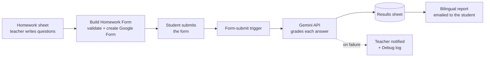

# AI Homework Builder

**A Google Sheets tool that builds English homework as a Google Form, grades every submission with the Gemini API, and emails each student a personalized, bilingual correction report automatically.**

I teach English to Brazilian adults, and correcting homework by hand took hours every week. With AI Homework Builder, I write the questions in a spreadsheet and click one button. The tool creates the form, and from then on every submission is graded and returned to the student without me touching it.

---

## What it does

- **Builds the homework form for you.** Write the questions in the *Homework* sheet, choose **Homework Builder → Build Homework Form**, and a complete Google Form is created in your Drive with its own response spreadsheet
- **Grades every answer with AI.** Each submission is corrected question by question with the Gemini API, as soon as the student submits
- **Sends bilingual feedback.** Students receive an email report with the corrected answer and feedback in **English and Portuguese** for each question, plus a special message for a perfect score
- **Supports 14 exercise types,** each with its own grading rules: affirmative, negative and interrogative sentences, pattern practice, substitution, translation, word bank, unscramble, complete the sentence, complete the verb, complete the idea, answer the question, write a question, and free sentences
- **Checks the homework before building it.** Validates question types and the number of questions in each section (Dynamic, Substitution, Translation)
- **Keeps a record of everything.** All results are saved in a *Results* sheet, and the teacher can generate a student report for any submission from the menu
- **Tells the teacher when something fails.** If grading fails, the teacher gets an email with the error details, the problem is logged, and no incomplete report is sent to the student

## How it works



## Design choices

**One prompt per exercise type.** A substitution drill and a translation need different grading. A shared prompt sets the general rules, and each of the 14 exercise types adds its own rules, so grading is consistent and an exercise type can be improved without affecting the others.

**Structured AI output.** Gemini is asked to return strict JSON (`correct`, `score`, `correctedAnswer`, `feedbackEnglish`, `feedbackPortuguese`, `teacherNotes`), so every result can be saved and formatted reliably.

**Everything configurable from the spreadsheet.** Book name, lesson number, Gemini model, question counts and the teacher's email all live in a *Settings* sheet, so a teacher can run it without opening the code.

**Students never get a half-graded report.** The email is sent only after every question has been graded and saved. Failures are logged and sent to the teacher instead.

## Tech stack

- **Google Apps Script** (V8 runtime)
- **Google Sheets** for settings, homework, results and logs
- **Google Forms** for the student-facing homework
- **Gemini API** for grading and feedback
- **Gmail (MailApp)** for student reports and teacher alerts

## Project structure

```
├── Code.gs                 Main build workflow
├── Menu.gs                 "Homework Builder" spreadsheet menu
├── Forms.gs                Creates the Google Form and response spreadsheet
├── Triggers.gs             Grades each submission when a form is submitted
├── Gemini.gs               Gemini API call and JSON parsing
├── Prompt.gs               Shared grading prompt and rules
├── *Prompt.gs              Grading rules for each exercise type (14 files)
├── StudentEmail.gs         Bilingual HTML report emailed to students
├── StudentReport.gs        Teacher-generated student reports
├── Validation.gs           Checks the homework before building
├── Settings.gs, System.gs  Reads settings and stores form IDs
└── appsscript.json         Apps Script project settings
```

## Setup

1. Create a Google Sheet with these tabs: **Settings**, **Homework**, **Question Types**, **System**, **Results**, **Student Reports** and **Debug**.
2. Open **Extensions → Apps Script** and add the files from this repository.
3. In the **Settings** tab, fill in your **Gemini API Key**, **Gemini Model**, **Teacher Email**, **Forms Folder URL**, **Book Name** and **Lesson Number**.
4. Run `initializeSystem()` once from the Apps Script editor.
5. Reload the spreadsheet, write your questions in the **Homework** tab, and choose **Homework Builder → Build Homework Form**.

**API keys are never stored in the code.** The Gemini key is read from the Settings sheet of your own copy.

## Privacy

Student answers are sent to the Gemini API for grading. Avoid including student names or emails in what is sent to the AI, and let students know their homework is checked by an AI service.

## Status

In use with my own English students. Built through AI-assisted development with ChatGPT.

---

**Amanda Santos**, educator building AI learning tools · [LinkedIn](https://www.linkedin.com/in/amanda-richelle-peffer-dos-santos-20802b263)
